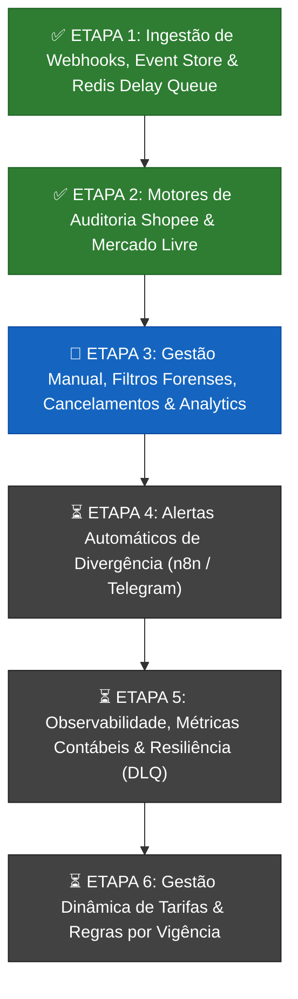

# 🗺️ PLANO DE PRÓXIMAS ETAPAS & ROADMAP DO PROJETO
## Microsserviço `order-integration`

---

## 🎯 1. Visão Geral e Status Atual

O **`order-integration`** é o hub central de integração, conciliação e auditoria financeira de pedidos de e-commerce.

* **✅ Etapa 1 (Concluída):** Ingestão com `X-Internal-API-Key`, Event Store (`marketplace_raw_events`), tabela `orders_master`, fila de atraso no Redis ZSet e Worker agendado.
* **✅ Etapa 2 (Concluída):** Motores de auditoria e prova real implementados:
  * **Shopee CPF:** 14% comissão base, 6% transação, R$ 4 fixa, R$ 5 sobretaxa (< R$ 8), frete vendedor, `ShopeeCpfFeeCalculator`.
  * **Mercado Livre:** Ingestão multicanal (`MercadoLivreOrderProcessor`), prova real contábil com extração do `sale_fee` do anúncio e faixas (< R$ 79), `MercadoLivreFeeCalculator` integrado ao Redis.

---

## 🚀 ETAPA 3: Gestão Manual, Filtros Forenses, Auditoria de Cancelamentos & Analytics

### 1. Conciliação Manual Forçada Sob Demanda
* **Rotas:** `POST /api/v1/orders/{id}/reconcile` e `POST /api/v1/orders/by-sn/{orderSn}/reconcile`
* **Comportamento:** Remove da fila do Redis, executa imediatamente o Strategy do marketplace correspondente (`ShopeeCpfFeeCalculator` ou `MercadoLivreFeeCalculator`), atualiza o PostgreSQL e retorna o pedido com links HATEOAS.

### 2. Filtros Forenses de Divergência em JSONB
* **Rota:** `GET /api/v1/orders?hasDivergence=true`
* **Comportamento:** Utiliza a `OrderSpecification` para consultar o predicado JSONB no PostgreSQL (`metadata -> 'auditoria_financeira' ->> 'has_divergence' = 'true'`), retornando apenas pedidos onde a plataforma cobrou taxas indevidas.

### 3. Auditoria Especializada de Cancelamentos
* **Comportamento na Ingestão (`CANCELLED`):** Extrai `cancel_reason`, `cancel_by` e `buyer_cancel_reason` para o nó `metadata.cancelamento`.
* **Filtro:** Permite listar por `status=CANCELLED` e segmentar cancelamentos por fraude/sistema, desistência do comprador ou falta de estoque.

### 4. Linha do Tempo Forense de Eventos Brutos (Event Store)
* **Rota:** `GET /api/v1/orders/{orderSn}/raw-events`
* **Comportamento:** Retorna todo o histórico probatório e cronológico dos webhooks recebidos para aquele pedido (`UNPAID` $\rightarrow$ `READY_TO_SHIP` $\rightarrow$ `COMPLETED` / `CANCELLED`) para contestação formal no suporte do marketplace.

### 5. Resumo Financeiro Consolidado (Analytics)
* **Rota:** `GET /api/v1/orders/financial-summary`
* **Retorno:** Total bruto faturado, comissões debitadas, valor líquido repassado, contagem de cancelamentos e **valor total de divergências detectadas em reais (R$)**.

---

## ⏳ ETAPA 4: Sistema de Alertas Automáticos de Divergência (n8n / Telegram)

* **Objetivo:** Notificação em tempo real no celular da equipe financeira sempre que o reconciler detectar taxas a mais.
* **Comportamento no Backend:**
  1. Ao conciliar com `has_divergence = true`, publica o evento Spring `OrderDivergenceDetectedEvent`.
  2. Dispara requisição HTTP assíncrona (`@Async`) para o webhook do n8n com o resumo da divergência (subtotal, repasse esperado, repasse real, prejuízo apurado e motivo).
* **Entrega:** n8n formata e envia mensagem automática no **Telegram / WhatsApp**.

---

## ⏳ ETAPA 5: Observabilidade, Métricas Contábeis & Resiliência Avançada (DLQ)

* **Objetivo:** Estabilidade enterprise, quarentena de falhas e dashboards contábeis em tempo real.
* **Pilares:**
  1. **Métricas Micrometer / Prometheus (`/actuator/prometheus`):**
     * Total de pedidos ingeridos e conciliados.
     * Valor acumulado de prejuízos evitados em R$.
     * Tamanho da fila pendente no Redis.
  2. **Dead-Letter Queue (DLQ):** Pedidos que excederem o limite de retentativas (`ESCROW_MAX_RETRIES=5`) são movidos para o conjunto `dcriar:orders:escrow_dlq` no Redis para quarentena sem travar o worker.
  3. **Dashboard:** Painel visual de faturamento bruto vs. líquido e taxas por canal.

---

## ⏳ ETAPA 6: Gestão Dinâmica e Escalável de Tarifas (Configuração & Vigência)

* **Objetivo:** Permitir atualização de taxas e comissões dos marketplaces sem necessidade de alterar código-fonte ou realizar novos deploys quando as plataformas atualizarem suas tabelas anuais.
* **Pilares de Implementação:**
  1. **Configuração Externalizada (`OrderIntegrationProperties`):**
     * Alíquotas de comissão base, taxas de processamento, tarifas fixas unitárias e limites de valor baixo externalizados para variáveis de ambiente e `application.yaml`.
  2. **Histórico de Vigência Contábil (`fee_rules_history`):**
     * Versionamento de regras com datas de início (`valid_from`) e fim (`valid_to`).
     * Permite que pedidos antigos continuem sendo auditados rigorosamente pela tabela da época da compra, sem distorcer o balanço contábil retroativo.
  3. **Fallback Resiliente:**
     * No Mercado Livre, prioridade contínua para a tarifa calculada na API do anúncio (`sale_fee`), utilizando as regras dinâmicas apenas como contingência e prova real comparativa.

---

## 🌐 EXPANSÕES FUTURAS (Novos Marketplaces)

* **Amazon Brasil:** Integrador e calculador de tarifas por categoria.
* **Magalu:** Integrador e comissões padrão Magalu Entregas.
