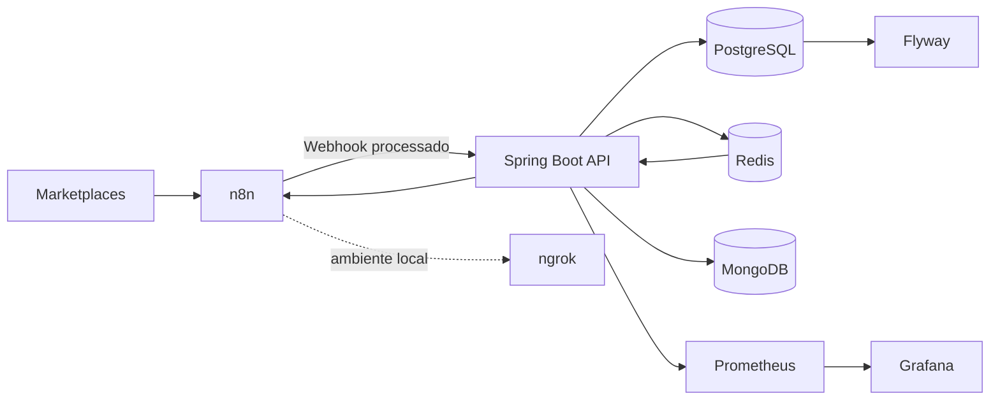

# Order Integration API

> Hub backend para ingestão, processamento, auditoria e conciliação de pedidos provenientes de marketplaces.

O **Order Integration API** é um microsserviço desenvolvido para centralizar o ciclo de vida de pedidos recebidos de diferentes canais de venda.

A aplicação foi projetada para receber eventos de marketplaces, transformar payloads específicos de cada plataforma em um modelo de domínio comum, persistir os dados para auditoria e executar regras de processamento e conciliação financeira.

O projeto utiliza uma arquitetura orientada a integrações, na qual o **n8n** atua como camada de automação/orquestração e o **Spring Boot** concentra as regras de negócio e a persistência.

> **Status:** em desenvolvimento ativo. A integração com os marketplaces e os workflows do n8n fazem parte do ecossistema, mas os workflows do n8n não são versionados neste repositório por conterem configurações e informações sensíveis.

---

## 🎯 O problema

Vender em múltiplos marketplaces significa lidar com APIs, webhooks, autenticação, estruturas de payload, status e regras financeiras diferentes para cada plataforma.

Além disso, o valor exibido em um pedido nem sempre representa o valor líquido que será recebido pelo vendedor. Taxas, frete, descontos e informações de settlement podem ser disponibilizados em momentos diferentes do ciclo do pedido.

Este projeto busca resolver esse problema criando uma camada central capaz de:

- receber eventos de diferentes marketplaces;
- normalizar estruturas específicas de cada plataforma;
- manter um modelo de pedido unificado;
- preservar o payload original para auditoria;
- evitar processamento duplicado de webhooks;
- acompanhar o ciclo de vida do pedido;
- calcular e auditar taxas;
- conciliar o valor estimado com o settlement financeiro real;
- disponibilizar consultas paginadas e filtráveis para acompanhamento dos pedidos.

---

## 🏗️ Arquitetura



### Responsabilidades

| Componente | Responsabilidade |
|---|---|
| **Marketplaces** | Origem dos pedidos, eventos e informações financeiras |
| **n8n** | Webhooks, automação, transformação de payloads e orquestração de integrações |
| **Spring Boot** | Regras de negócio, processamento, APIs REST e persistência |
| **PostgreSQL** | Dados relacionais e estado principal dos pedidos |
| **Redis** | Idempotência, controle de eventos e fila de atraso para processos assíncronos |
| **MongoDB** | Persistência de credenciais/configurações específicas de integrações |
| **Flyway** | Versionamento do schema do PostgreSQL |
| **Prometheus** | Coleta de métricas da aplicação |
| **Grafana** | Visualização e acompanhamento das métricas |
| **ngrok** | Exposição de endpoints locais para testes de webhooks |

---

## 🔄 Fluxo de um pedido

Um fluxo simplificado do processamento é:

```text
Marketplace
    │
    │ Evento / Webhook
    ▼
  n8n
    │
    │ Payload normalizado
    ▼
Spring Boot
    │
    ├── Autenticação interna
    ├── Identificação da plataforma
    ├── Idempotência
    ├── Processamento do pedido
    ├── Cálculo/auditoria de taxas
    │
    ▼
PostgreSQL
    │
    └── Estado do pedido

COMPLETED
    │
    ▼
Redis ZSet
    │
    │ delay configurado
    ▼
Consulta de Settlement/Escrow
    │
    ▼
Conciliação financeira
```

### Por que existe uma etapa de atraso?

Algumas informações financeiras definitivas do marketplace não estão disponíveis no mesmo momento em que o pedido muda de status.

Por isso, pedidos que chegam ao estado de conclusão podem ser colocados em uma **delay queue baseada em Redis ZSet**. Após o período configurado, o sistema pode consultar o settlement/escrow e comparar o valor esperado com o valor efetivamente repassado.

Isso permite separar duas etapas:

1. **Estimativa:** informações disponíveis durante o processamento inicial do pedido.
2. **Conciliação:** informações financeiras definitivas disponibilizadas posteriormente pelo marketplace.

---

## 💰 Auditoria financeira

Um dos objetivos do projeto é não tratar o valor da venda como sinônimo do valor líquido recebido.

O processamento financeiro considera informações como:

- valor bruto do pedido;
- taxas do marketplace;
- frete estimado;
- frete efetivamente cobrado;
- descontos e ajustes quando aplicáveis;
- valor de settlement/escrow;
- divergências entre cálculo teórico e dados retornados pela plataforma.

A arquitetura possui uma camada comum de cálculo financeiro e implementações específicas por marketplace, permitindo que cada plataforma mantenha suas próprias regras sem contaminar o domínio compartilhado.

---

## 🔐 Segurança e idempotência

Os webhooks destinados à API são protegidos por uma **Internal API Key**, enviada através do header:

```http
X-Internal-API-Key: <internal-key>
```

A ingestão também considera a origem da plataforma e o identificador da loja quando disponível.

O processamento de eventos foi projetado para lidar com retentativas de webhooks. Antes de executar novamente uma alteração já processada, o sistema verifica o estado persistido para evitar duplicação de processamento.

---

## 🌐 API

### Webhooks

```http
POST /api/v1/webhooks/{platform}
```

Responsável pela ingestão de eventos de marketplaces.

Headers utilizados:

```http
X-Internal-API-Key: <internal-key>
X-Shop-Id: <shop-id>
```

O corpo recebe o payload JSON do evento e a plataforma é informada através da URL.

### Pedidos

```http
GET /api/v1/orders
GET /api/v1/orders/{id}
```

A consulta de pedidos suporta:

- paginação;
- ordenação;
- filtros dinâmicos;
- representação HATEOAS.

### Canais de marketplace

```http
GET   /api/v1/channels
GET   /api/v1/channels/{id}
PATCH /api/v1/channels/{id}/status
```

Esses endpoints permitem consultar os canais cadastrados e controlar seu estado operacional.

---

## 📖 OpenAPI / Swagger

A API utiliza **Springdoc OpenAPI** para documentação dos endpoints.

Com a aplicação executando localmente, a interface do Swagger pode ser acessada em:

```text
http://localhost:8081/swagger-ui/index.html
```

A documentação OpenAPI também é gerada pela própria aplicação.

---

## 🗃️ Persistência

### PostgreSQL

O PostgreSQL armazena os dados principais do domínio, incluindo pedidos e informações necessárias para o processamento e auditoria.

As alterações de schema são controladas pelo **Flyway**:

```text
src/main/resources/db/migration/
```

O projeto utiliza `ddl-auto=validate`, deixando a evolução do schema sob responsabilidade das migrations.

### JSONB

Dados específicos de cada marketplace podem variar significativamente. Para evitar que cada diferença externa gere alterações desnecessárias no modelo relacional, o projeto utiliza uma combinação de:

- campos relacionais para informações importantes ao domínio;
- `JSONB` para dados específicos/dinâmicos;
- payload original para auditoria e rastreabilidade.

---

## ⚡ Redis

O Redis possui dois papéis importantes na arquitetura:

### Idempotência

Ajuda a controlar eventos repetidos e evitar processamento duplicado durante retentativas dos marketplaces.

### Delay Queue

A conciliação financeira pode depender de informações que só ficam disponíveis algum tempo depois do evento original.

Para isso, o projeto utiliza **Sorted Sets (ZSet)** como mecanismo de fila baseada em tempo.

O identificador do pedido pode ser associado a um timestamp futuro e processado quando atingir o momento configurado.

---

## 🍃 MongoDB

O MongoDB é utilizado para informações relacionadas às credenciais/configurações específicas das integrações.

Essa separação evita misturar dados operacionais dos pedidos com informações de configuração das plataformas.

Credenciais reais não fazem parte do repositório.

---

## 📊 Observabilidade

A aplicação utiliza **Spring Boot Actuator** e **Micrometer** para disponibilizar métricas.

O ambiente de desenvolvimento inclui:

- **Prometheus** para coleta das métricas;
- **Grafana** para visualização;
- **Spring Boot Actuator** para endpoints de observabilidade.

A infraestrutura pode ser iniciada através do Docker Compose.

---

## 🐳 Ambiente de desenvolvimento

O ambiente local é executado através do Docker Compose.

Serviços disponíveis no `docker-compose.dev.yml`:

- PostgreSQL
- MongoDB
- Redis
- Redis Insight
- Prometheus
- Grafana
- n8n
- ngrok
- SonarQube
- Order Integration API

### Pré-requisitos

- Java 26
- Docker
- Docker Compose
- Git

### Configuração

Os arquivos de exemplo ficam no repositório:

```text
.env.dev.example
.env.prod.example
```

Crie o arquivo local de desenvolvimento a partir do template:

```bash
cp .env.dev.example .env.dev
```

Depois configure os valores necessários para seu ambiente.

> **Nunca committe `.env.dev`, tokens, senhas ou credenciais reais.**

### Subindo o ambiente

```bash
docker compose -f docker-compose.dev.yml up --build
```

A API fica disponível em:

```text
http://localhost:8081
```

n8n:

```text
http://localhost:5679
```

Redis Insight:

```text
http://localhost:5540
```

Prometheus:

```text
http://localhost:9090
```

Grafana:

```text
http://localhost:3000
```

SonarQube:

```text
http://localhost:9000
```

---

## 🔗 n8n e workflows de integração

O n8n faz parte da arquitetura do projeto, principalmente como camada de **orquestração e integração externa**.

Os workflows não são versionados neste repositório porque os exports do n8n podem conter configurações, URLs, identificadores e informações sensíveis do ambiente de integração.

Em um ambiente real, os workflows podem ser mantidos separadamente e configurados para encaminhar os eventos para:

```text
Marketplace
    ↓
n8n Webhook
    ↓
Transformação / validação
    ↓
POST /api/v1/webhooks/{platform}
    ↓
Order Integration API
```

Essa separação também permite atualizar os fluxos de automação sem alterar diretamente o núcleo de regras de negócio da API.

---

## 🧱 Estrutura do projeto

A aplicação é organizada por **camadas e subdomínios**, mantendo a API, domínio e configurações separadas.

```text
src/main/java/com/dcriar/orderintegration/
│
├── api/
│   ├── controller/
│   ├── dto/
│   ├── hateoas/
│   ├── mapper/
│   └── validation/
│
├── config/
│
├── domain/
│   ├── channel/
│   ├── common/
│   ├── marketplace/
│   └── order/
│
└── exception/
```

### API

Responsável pela exposição dos endpoints REST, DTOs, mapeamentos, validações e representação HATEOAS.

### Domain

Concentra entidades, regras de negócio, services, repositories, processors, calculators e integrações específicas dos marketplaces.

### Config

Centraliza configurações como timezone, Jackson, OpenAPI, propriedades tipadas, RestClient e scheduling.

### Exception

Centraliza exceções e tratamento global de erros através do padrão `ProblemDetail` / RFC 7807.

---

## 🧠 Decisões de arquitetura

Algumas decisões importantes adotadas no projeto:

- **Rich Domain Model** para manter regras de negócio próximas das entidades;
- interfaces de serviço separadas das implementações;
- injeção de dependência por construtor;
- `@ConfigurationProperties` para configurações tipadas;
- MapStruct para mapeamento entre entidades, DTOs e modelos;
- Spring Data JPA Specifications para filtros dinâmicos;
- paginação obrigatória nas consultas de listagem;
- Spring HATEOAS para links type-safe;
- `ProblemDetail` seguindo RFC 7807 para erros REST;
- `OffsetDateTime` e timezone centralizado em `America/Sao_Paulo`;
- normalização automática de Strings na entrada via Jackson;
- PostgreSQL como fonte principal para dados transacionais;
- Redis para processamento dependente de tempo e controle de eventos;
- MongoDB para dados de credenciais/configuração das integrações.

As decisões e regras completas do projeto estão documentadas em:

[`docs/arquitetura.md`](docs/arquitetura.md)

---

## 🧪 Testes

Os testes automatizados ficam em:

```text
src/test/
```

Para executar a suíte:

```bash
./mvnw test
```

No Windows:

```bash
mvnw.cmd test
```

---

## 🛠️ Stack

| Tecnologia | Uso |
|---|---|
| **Java 26** | Linguagem principal |
| **Spring Boot 4.1.1** | Framework backend |
| **Spring Data JPA** | Persistência relacional |
| **PostgreSQL** | Banco transacional |
| **Flyway** | Database migrations |
| **Redis** | Idempotência e processamento assíncrono |
| **MongoDB** | Credenciais/configurações de integração |
| **MapStruct** | Object mapping |
| **Spring HATEOAS** | Hypermedia REST |
| **Springdoc OpenAPI** | Documentação da API |
| **n8n** | Automação e integração |
| **Docker Compose** | Ambiente local |
| **Prometheus** | Métricas |
| **Grafana** | Observabilidade |
| **SonarQube** | Análise de qualidade de código |
| **ngrok** | Testes de webhooks externos |

---

## 📈 Evolução do projeto

O projeto está sendo desenvolvido de forma incremental.

Próximos pontos de evolução incluem:

- ampliar os adapters para novos marketplaces;
- aumentar a cobertura de testes de integração;
- evoluir a auditoria financeira;
- aprimorar observabilidade e alertas;
- documentar cenários completos de integração;
- adicionar novos fluxos de automação conforme novos canais forem incorporados.

---

## 👨‍💻 Autor

**Vinicius Oliveira**

Projeto desenvolvido como estudo prático de **Java, Spring Boot, integrações de marketplaces, processamento de eventos, automação e arquitetura backend**.

---

## 📄 License

Este projeto é destinado a fins de estudo, portfólio e experimentação técnica.
