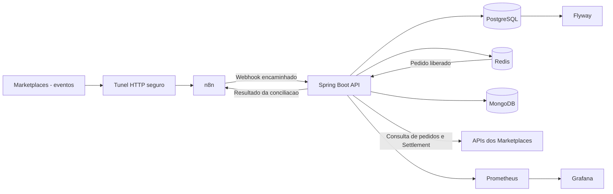
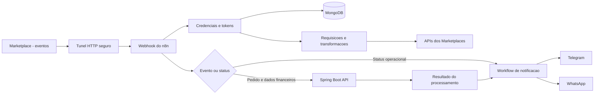

# Order Integration API

O **Order Integration API** é um microsserviço desenvolvido para centralizar o ciclo de vida de pedidos recebidos de diferentes canais de venda.

A aplicação foi projetada para receber eventos de marketplaces, transformar payloads específicos de cada plataforma em um modelo de domínio comum, persistir os dados para auditoria e executar regras de processamento e conciliação financeira.

O projeto utiliza uma arquitetura orientada a integrações, na qual o **n8n** atua como camada de automação/orquestração e o **Spring Boot** concentra as regras de negócio e a persistência.

> **Status:** em desenvolvimento ativo. A integração com os marketplaces e os workflows do n8n fazem parte do ecossistema, mas os workflows do n8n não são versionados neste repositório por conterem configurações e informações sensíveis.

---

## 🎯 O problema

Vender em múltiplos marketplaces significa lidar com APIs, webhooks, autenticação, estruturas de payload, status e regras financeiras diferentes para cada plataforma.

Além disso, o valor exibido em um pedido nem sempre representa o valor líquido que será recebido pelo vendedor. Taxas, frete, descontos e informações de settlement podem ser disponibilizados em momentos diferentes do ciclo do pedido.

Este projeto busca resolver esse problema criando uma camada central capaz de:

- receber eventos de diferentes marketplaces;
- normalizar estruturas específicas de cada plataforma;
- manter um modelo de pedido unificado;
- preservar o payload original para auditoria;
- evitar processamento duplicado de webhooks;
- acompanhar o ciclo de vida do pedido;
- calcular e auditar taxas;
- conciliar o valor estimado com o settlement financeiro real;
- disponibilizar consultas paginadas e filtráveis para acompanhamento dos pedidos.

---

## 🏗️ Arquitetura

### Responsabilidades

| Componente            | Responsabilidade                                                                       |
|-----------------------|----------------------------------------------------------------------------------------|
| **Marketplaces**      | Origem dos pedidos, eventos e informações financeiras                                  |
| **n8n**               | Recepção de webhooks, automação, transformação/validação e orquestração de integrações |
| **Spring Boot**       | Regras de negócio, processamento, APIs REST e persistência                             |
| **PostgreSQL**        | Dados relacionais e estado principal dos pedidos                                       |
| **Redis**             | Fila de atraso, reagendamento de tentativas e DLQ para conciliação assíncrona          |
| **MongoDB**           | Persistência de credenciais/configurações específicas de integrações                   |
| **Flyway**            | Versionamento do schema do PostgreSQL                                                  |
| **Prometheus**        | Coleta de métricas da aplicação                                                        |
| **Grafana**           | Visualização e acompanhamento das métricas                                             |
| **Túnel HTTP seguro** | Exposição temporária do n8n local para receber webhooks externos                       |

---

## 🔁 Arquitetura do n8n

O n8n funciona como a camada de automação e orquestração do ecossistema. Ele conecta os marketplaces, o Spring Boot, o MongoDB e os canais de notificação, permitindo alterar os workflows sem modificar o núcleo da API.

Os workflows não são versionados neste repositório porque podem conter URLs, identificadores, credenciais e configurações sensíveis. A arquitetura abaixo representa o fluxo conceitual dessa automação:

### Fluxo de automação

De forma resumida, o n8n pode:

1. receber eventos dos marketplaces através do túnel HTTP seguro;
2. identificar a plataforma e o tipo de evento;
3. consultar credenciais no MongoDB;
4. verificar, renovar e armazenar tokens de acesso;
5. realizar requisições às APIs dos marketplaces quando o workflow exigir;
6. transformar e encaminhar pedidos e dados financeiros para os endpoints do Spring Boot;
7. encaminhar diretamente para notificações os status operacionais que não dependem de regras da API;
8. receber o resultado do processamento ou da conciliação;
9. enviar notificações operacionais e financeiras para Telegram e WhatsApp.

Status comuns, como `READY_TO_SHIP`, `COMPLETED` antes da conciliação financeira e `CANCELLED`, podem ser tratados diretamente pelo n8n para envio de mensagens. Ainda assim, o evento deve ser encaminhado ao Spring Boot quando precisar ser persistido, auditado ou processado pelas regras de negócio.

O n8n coordena o fluxo, mas as regras centrais de domínio, a persistência transacional dos pedidos, a auditoria financeira e a conciliação permanecem sob responsabilidade do Spring Boot.

No código versionado, a API já possui integrações de credenciais e clients de Settlement para Shopee e Mercado Livre. O n8n permanece como a camada externa de automação, podendo assumir etapas adicionais de consulta, renovação de tokens, transformação e notificações conforme os workflows do ecossistema evoluírem.

---

## 🛠️ Stack

| Tecnologia            | Uso                                                          |
|-----------------------|--------------------------------------------------------------|
| **Java 26**           | Linguagem principal                                          |
| **Spring Boot 4.1.1** | Framework backend                                            |
| **Spring Data JPA**   | Persistência relacional                                      |
| **PostgreSQL**        | Banco transacional                                           |
| **Flyway**            | Database migrations                                          |
| **Redis**             | Delay queue, retry e DLQ da conciliação                      |
| **MongoDB**           | Credenciais/configurações de integração                      |
| **MapStruct**         | Object mapping                                               |
| **Spring HATEOAS**    | Hypermedia REST                                              |
| **Springdoc OpenAPI** | Documentação da API                                          |
| **n8n**               | Automação e integração                                       |
| **Docker Compose**    | Ambiente local                                               |
| **Prometheus**        | Métricas                                                     |
| **Grafana**           | Observabilidade                                              |
| **SonarQube**         | Análise de qualidade de código                               |
| **Túnel HTTP seguro** | Exposição temporária do n8n para testes de webhooks externos |

---

## 📈 Evolução do projeto

O projeto está sendo desenvolvido de forma incremental.

## 👨‍💻 Autor

**Vinicius Oliveira**

Projeto desenvolvido como estudo prático de **Java, Spring Boot, integrações de marketplaces, processamento de eventos, automação e arquitetura backend**.

---

## 📄 License

Este projeto está disponível sob a [licença MIT](LICENSE).
